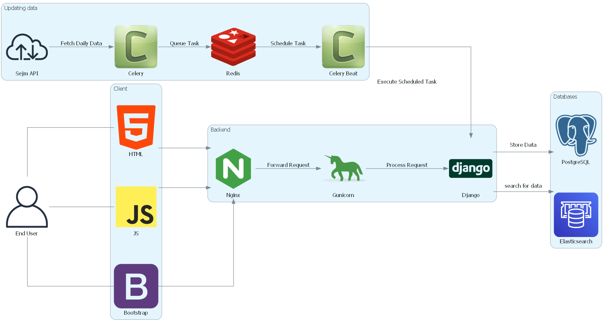

# Analiza biznesowa

## 2. Przeznaczenie projektu

import Tabs from '@theme/Tabs';
import TabItem from '@theme/TabItem';

Aby lepiej zrozumieć, dlaczego zdecydowałem się na zinicjowanie projektu, poniżej przedstawiam kilka przykładów zastosowań sejm-stats.

<Tabs
    defaultValue="poslowie"
    values={[
        {label: 'Dla Posłów i Biur Poselskich', value: 'poslowie'},
        {label: 'Dla osób szczególnie interesujących polityką', value: 'polityka'},
        {label: 'Dla Przedsiębiorców', value: 'przedsiebiorcy'},
    ]
}>

<TabItem value="poslowie">

#### Przypadek użycia:

Ułatwienie dostępu do danych na temat działalności posłów, analizy trendów i zachowań politycznych, które są kluczowe dla wewnętrznych strategii politycznych i legislacyjnych.

#### Scenariusz:

*Poseł A* chce ocenić, jak często *Poseł B* angażuje się w debaty i głosowania dotyczące polityki ekologicznej. Używając Sejm 2.0, szybko uzyskuje przekrojową analizę udziału Posła B w dyskusjach, jego głosowania i proponowane projekty ustaw, co pozwala na strategię wewnętrzną swojego ugrupowania przed nadchodzącymi wyborami.

</TabItem>

<TabItem value="polityka">

#### Przypadek użycia:

Zwiększenie świadomości obywateli na temat działań sejmowych i pomaganie w informowanym wyborze przedstawicieli na podstawie ich aktywności parlamentarnej i głosowań.

#### Scenariusz:

 *Obywatelka C* interesuje się działaniami posłów na temat praw kobiet. Przed wyborami parlamentarnymi korzysta z Sejm-stats, aby sprawdzić historię głosowań posłów, ich wypowiedzi i inicjatywy związane z tą tematyką, co pomaga jej podjąć świadomą decyzję wyborczą.

</TabItem>

<TabItem value="przedsiebiorcy">

#### Przypadek użycia:

Zapewnienie aktualnych informacji o zmieniającym się prawodawstwie, co pozwala na lepsze planowanie biznesowe i adaptację do nowych regulacji prawnych.

#### Scenariusz:

Przedsiębiorca D, właściciel firmy farmaceutycznej, potrzebuje bieżących informacji o zmianach w przepisach dotyczących reklamy leków. Wykorzystuje Sejm 2.0 do otrzymywania powiadomień o nowych projektach ustaw, głosowaniach i uchwałach, co pozwala na szybką adaptację strategii marketingowej firmy do aktualnego stanu prawnego.

</TabItem>

</Tabs>

---

## 3. Stos technologiczny

Każdy kto odwiedził oficjalną stronę sejmową wie, że przy jej projektowaniu coś poszło nie tak... Aby nie popełnić błędu ekipy z sejmu, przed rozpoczęciem pracy nad projektem, przeprowadziłem analizę technologiczną, aby wybrać odpowiednie narzędzia i technologie, które pozwolą na szybki rozwój aplikacji i łatwą skalowalność w przyszłości.

:::important uwaga
W gotowym prototypie aplikacji niektóre z wymienionych technologii nie zostały jeszcze zaimplementowane.
:::

Szególnie istotny jest tutaj wybór `elasticsearch`, który pozawala na szybkie wyszukiwanie z użyciem uczenia maszynowego i analizy języka naturalnego. Dzięki temu, użytkownicy mogą szybko znaleźć interesujące ich informacje, a my możemy dostarczać spersonalizowane rekomendacje.

Poza technologiami przedstawionymi na wykresie do projektu użyte zostaną usługi `AWS` w tym:

- AWS EC2 - serwer wirtualny, na którym będzie uruchomiona aplikacja
- AWS RDS - baza danych, w której przechowywane będą dane sejmowe
- AWS OpenSearch - wyszukiwarka, która umożliwi szybkie wyszukiwanie danych
- AWS bedrock - model językowy (LLM), który pozwoli na streszczenie tekstów (ustaw, interpelacji, wypowiedzi, itp.) w sposób inteligentny i zrozumiały dla użytkownika 

---

## 4. Model Biznesowy
- **Dotacje:**  
W początkowej fazie projektu planujemy pozyskać fundusze poprzez dotacje od osób i organizacji zainteresowanych lepszą jakością informacji publicznej.

- **Reklamy i Usługi Premium:**  
W dłuższej perspektywie, planujemy wprowadzenie modelu freemium z opcjami subskrypcji premium oraz umieszczaniem reklam.

---

## 5. Analiza SWOT
**Mocne Strony:**  
- Innowacyjność
- Transparentność danych
- Zaawansowane narzędzia wyszukiwania

**Słabe Strony:**  
- Nowość na rynku
- Ograniczony budżet początkowy

**Szanse:**  
- Rosnące zapotrzebowanie na transparentność w polityce
- Potencjalne partnerstwa z organizacjami medialnymi i edukacyjnymi

**Zagrożenia:**  
- Potencjalne zmiany w prawodawstwie ograniczające dostęp do danych publicznych
- Wysoka konkurencja w przestrzeni aplikacji informacyjnych

---

## 6. Kosztorys i Finansowanie

:::danger 

Dane w tabeli są szacunkowe i mogą ulec zmianie w zależności od rozwoju projektu.

:::

| Pozycja         | Koszt (PLN)              | Uzasadnienie                                                                                                          |
| --------------- | ------------------------ | --------------------------------------------------------------------------------------------------------------------- |
| Domena          | 50 - 100                 | Opłata za roczną rejestrację nazwy domeny, podstawowa inwestycja umożliwiająca identyfikację projektu w internecie.   |
| AWS Services    | < 200/miesiąc            | Pokrycie kosztów hostingu, przechowywania danych i operacji LLM na potrzeby  aplikacji (ec2, OpenSearch, s3, bedrock) |
| MDBootstrap Pro | 500 (opcjonalnie)        | Zakup licencji na premium komponenty UI, które ulepszają estetykę oraz UX aplikacji.                                  |
| GitHub Copilot  | 50/miesiąc (opcjonalnie) | Subskrypcja narzędzia wspierającego szybsze i efektywniejsze pisanie kodu.                                            |

---

## 7. Źródła Czerpania Korzyści
- **Narzędzie do Badań i Edukacji:**  
Aplikacja może służyć jako platforma badawcza, dostarczając danych dla analiz naukowych oraz jako materiał dydaktyczny.

- **Raporty i Analizy na Zamówienie:**  
Oferujemy tworzenie spersonalizowanych raportów i analiz, które mogą stanowić dodatkowy strumień przychodów.

---

## 8. O Autorze
Michał Skibiński to inżynier systemów z Wrocławia, który posiada bogate doświadczenie w tworzeniu i zarządzaniu projektami IT. Jako Python full-stack developer, współpracował z Nokia, gdzie rozwijał umiejętności w zakresie zarządzania dużymi aplikacjami webowymi, bazami danych oraz konteneryzacją aplikacji.

---

## 9. Misja Projektu
Misją Sejm 2.0 jest zwiększenie świadomości i zaangażowania obywateli w procesy demokratyczne poprzez dostarczanie przejrzystych, aktualnych i dogłębnych informacji o działaniach polskiego sejmu. Wierzymy, że dostęp do jasnych i rzetelnych danych jest podstawą świadomego uczestnictwa w życiu publicznym i kształtowaniu przyszłości naszego kraju.

---

## 10. Kontakt i Współpraca
Jesteśmy otwarci na wszelkie formy współpracy. Jeśli jesteś zainteresowany wsparciem projektu, partnerstwem lub chcesz uzyskać więcej informacji, skontaktuj się z nami:

- E-mail: [mskibinski09@gmail.com](mailto:mskibinski09@gmail.com)
- GitHub: [github.com/michalskibinski09](https://github.com/michalskibinski09)

---

## 11. Jak Wsparcie Projekt?
- **Dotacje:**  
Wszelkie wsparcie finansowe można przekazać poprzez naszą platformę crowdfundingu lub bezpośrednio na konto projektu.

- **Rozprzestrzenianie Wiedzy:**  
Pomóż nam docierać do szerszej publiczności poprzez udostępnianie informacji o Sejm 2.0 w mediach społecznościowych i wśród znajomych.

- **Wolontariat:**  
Jeżeli chcesz aktywnie uczestniczyć w rozwoju projektu, zapraszamy do kontaktu. Szukamy osób zainteresowanych polityką, programistów, analityków danych i wolontariuszy do pomocy przy promocji.

