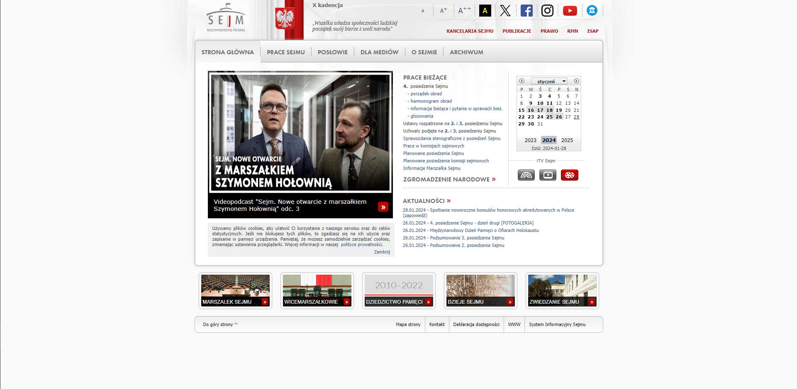
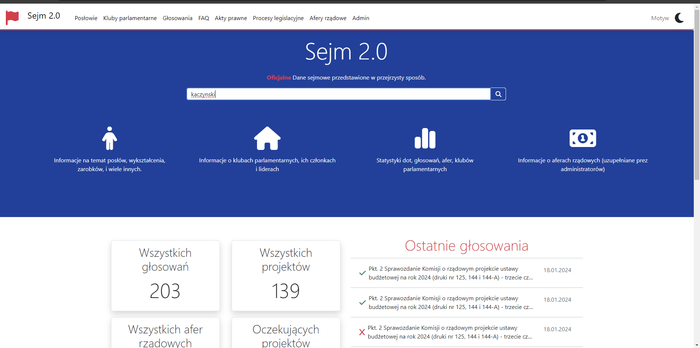
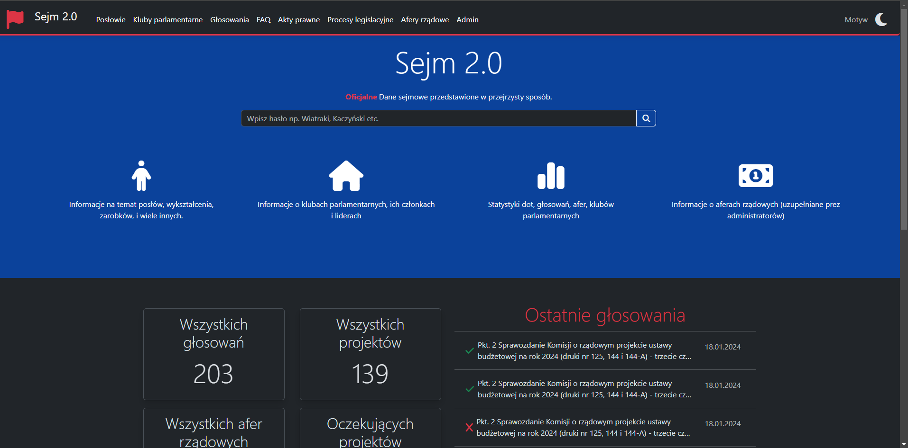
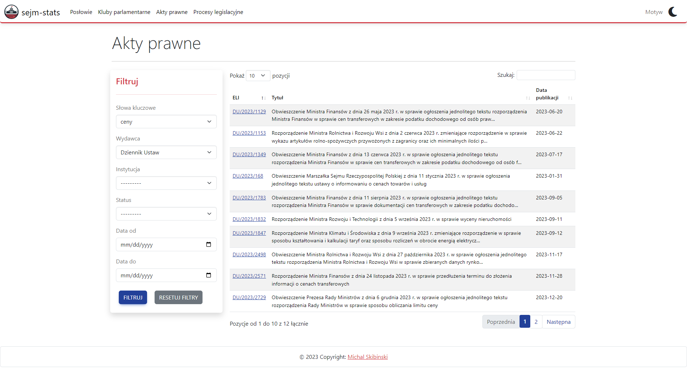
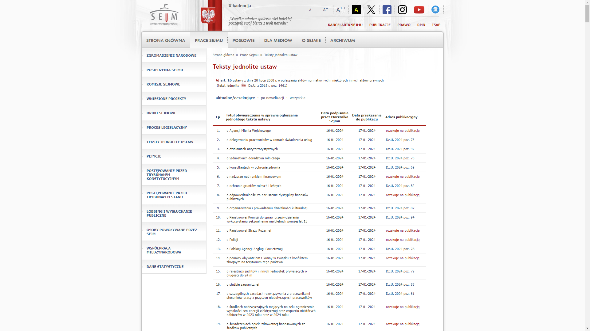
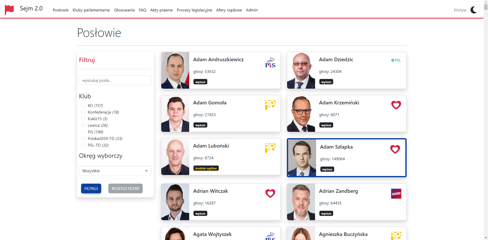
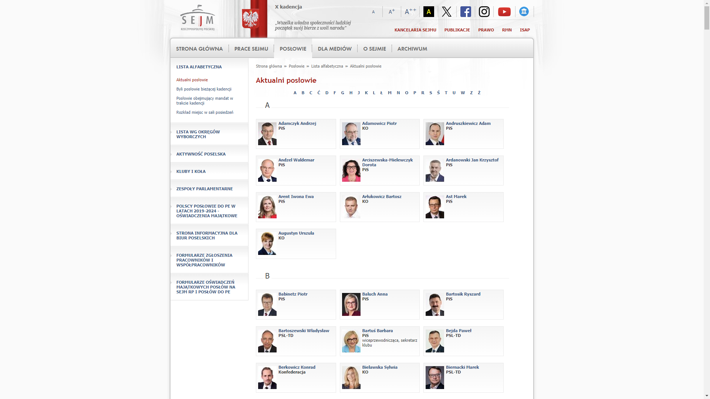
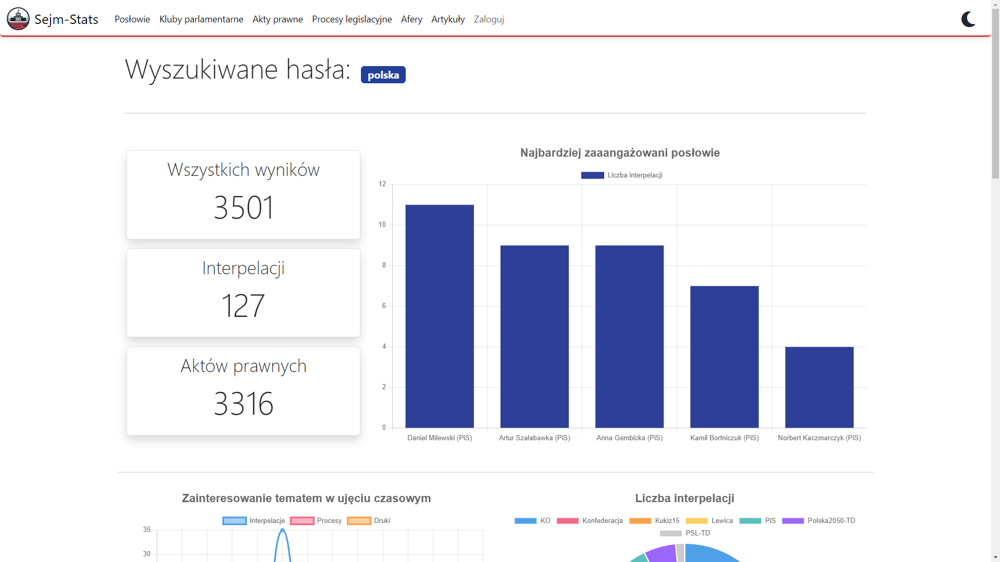
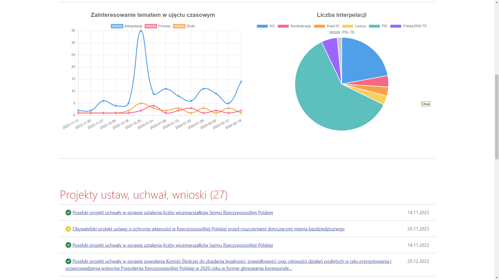

import Tabs from '@theme/Tabs';
import TabItem from '@theme/TabItem';

# Wstęp 🚀

## Motywacja

Każdy kto miał przyjemność korzystać z oficjalnej strony sejmowej, napewno doznał uczucia cofnięcia się w czasie do lat 90. Nieintuicyjny interfejs użytkownika, niespójna estetyka strony, brak możliwości wyszukiwania po słowach kluczowych to tylko niektóre z problemów, z którymi musieliśmy się zmierzyć.
Dlatego zdecydowałem się zacząć projekt **`sejm-stats`**, który ma naprawić te problemy i rozszerzyć funkcjonalność o dodatkowe funkcjonalności.

## Dlaczego to robię?

Projekt **`sejm-stats`** to moja inicjatywa na rzecz lepszej dostępności informacji sejmowych dla wszystkich. Nie kieruję się motywami finansowymi, a przede wszystkim pragnieniem, by każdy wiedział co dzieje się w kraju. Nie jestem związany z żadną partią polityczną – moim celem jest obiektywne i wygodne dostarczanie informacji, aby ułatwić obywatelom zrozumienie procesów decyzyjnych w naszym kraju. Jednak w miarę rozwoju projektu zdałem sobie sprawę, że aby móc utrzymać projekt w dalszym ciągu, muszę znaleźć sposób na jego finansowanie. 

---

## Przewaga nad oficjalną stroną sejmową

Zapraszamy do odkrywania naszej strony, która nie tylko gromadzi wszystkie informacje dostępne na oficjalnej stronie sejmowej, ale także oferuje wiele więcej!

#### Posłowie
- Poznaj naszych posłów! Znajdziesz tu podstawowe informacje, adresy e-mail, wyniki wyborcze, wykształcenie i profesję.
- Śledź ich działania! Lista projektów ustaw, uchwał i wniosków, w których dany poseł uczestniczył.
- Przeczytaj artykuły związane z danym posłem.
- Sprawdź statystyki dotyczące aktywności posła, liczba interpelacji, projektów ustaw, głosowań.
- Dowiedz się, jak głosują posłowie zgodnie z dyscypliną partyjną.
- Filtruj posłów według aktywności, okręgu wyborczym, klubu.
- Subskrybuj wszelką aktywność związaną z danym posłem.
- (w przygotowaniu) Zajrzyj do portfela posła - dane dotyczące majątku posła.
- (w przygotowaniu) Odkryj moc danych sejmowych z wykorzystaniem uczenia maszynowego, aby wykrywać anomalie i nieprawidłowości w działaniach posłów 🤖

#### Aktywność sejmowa
- Wykorzystaj zaawansowany silnik wyszukiwania przeszukujący akty prawne, projekty ustaw/uchwał, wnioski, interpelacje.
- Analizuj statystyki i wizualizacje dotyczące wyników wyszukiwania: zainteresowanie w ujęciu czasowym, najaktywniejsi posłowie, kluby, etc.

#### Kluby
- Przejrzyj listę zgłoszonych projektów ustaw, uchwał, wniosków przez poszczególne kluby. TBD

#### Pozostałe dane sejmowe
- Śledź procesy legislacyjne, wraz z ich etapami.
- Subskrybuj dany proces legislacyjny.
- Odfiltruj tylko nie zakończone procesy (stan zamrażarki sejmowej).
- Przejrzyj listę aktów prawnych z możliwością inteligentnego filtrowania i wyszukiwania.
- Sprawdź listę głosowań wraz z wynikami.
- W każdym z widoków znajdziesz linki do oficjalnych dokumentów sejmowych.
- (w przygotowaniu) Skorzystaj z inteligentnych streszczeń uchwał, ustaw, projektów ustaw itp. z wykorzystaniem modeli sztucznej inteligencji (NLP) 📝
- Odkryj wizualizacje danych zintegrowane z aplikacją 📊

#### Artykuły
- Przeczytaj artykuły pisane przez dziennikarzy i sztuczną inteligencję (weryfikowane przez klasyfikatory tematyczne).
- Każdy artykuł jest powiązany z klubem parlamentarnym oraz posłami.
- (w przygotowaniu) Artykuły są łatwe do napisania dla osób nietechnicznych, dzięki wbudowanemu edytorowi Markdown.
- (w przygotowaniu) Komentuj artykuły i zapisuj je do późniejszego czytania.
- Przejrzyj listę afer rządowych (weryfikowane przez klasyfikatory tematyczne). Afery powiązane z posłami, klubami parlamentarnymi, procesami legislacyjnymi.
- (w przygotowaniu) Komentuj i oceniaj artykuły.

- (w przygotowaniu) Eksportuj dane do plików CSV, JSON, XML  w celu dalszej analizy 📁
- Ciesz się intuicyjnym interfejsem użytkownika oferującym motyw jasny i ciemny ☀️
---

## Zestawenie interfejsów

:::important Uwaga

Widoczne poniżej zrzuty ekranu pochodzą z POC (dowodu koncepcji) projektu. Finalna wersja może się różnić.

:::

<Tabs
    defaultValue="light"
    values={[
        {label: 'oficjalna strona sejmu', value: 'gov'},
        {label: 'sejm-stats motyw jasny', value: 'light'},
        {label: 'sejm-stats motyw ciemny', value: 'dark'},
    ]}>

<TabItem value="gov">

    

</TabItem>

<TabItem value="light">

</TabItem>

<TabItem value="dark">

</TabItem>

</Tabs>

### Lista aktów prawnych

<Tabs
    defaultValue="procesy_sejm"
    values={[
        {label: 'sejm.gov.pl', value: 'procesy_sejm'},
        {label: 'sejm-stats', value: 'procesy'},
    ]
}>

<TabItem value="procesy">

</TabItem>

<TabItem value="procesy_sejm">

</TabItem>

</Tabs>

### Lista posłów

<Tabs
    defaultValue="poslowie"
    values={[
        {label: 'sejm.gov.pl', value: 'poslowie_sejm'},
        {label: 'sejm-stats', value: 'poslowie'},
    ]
}>

<TabItem value="poslowie">

</TabItem>

<TabItem value="poslowie_sejm">

</TabItem>

</Tabs>

### Zaawansowane wyszukiwanie

:::important Uwaga

Aktualnie trwa jeszcze używana jest baza danych do prototypowania, dlatego dane są niekompletne.

:::

<Tabs
    defaultValue="search"
    values={[
        {label: 'widok 1', value: 'search'},
        {label: 'widok 2', value: 'search2'},
    ]
}>

<TabItem value="search">

</TabItem>

<TabItem value="search2">

</TabItem>

</Tabs>

